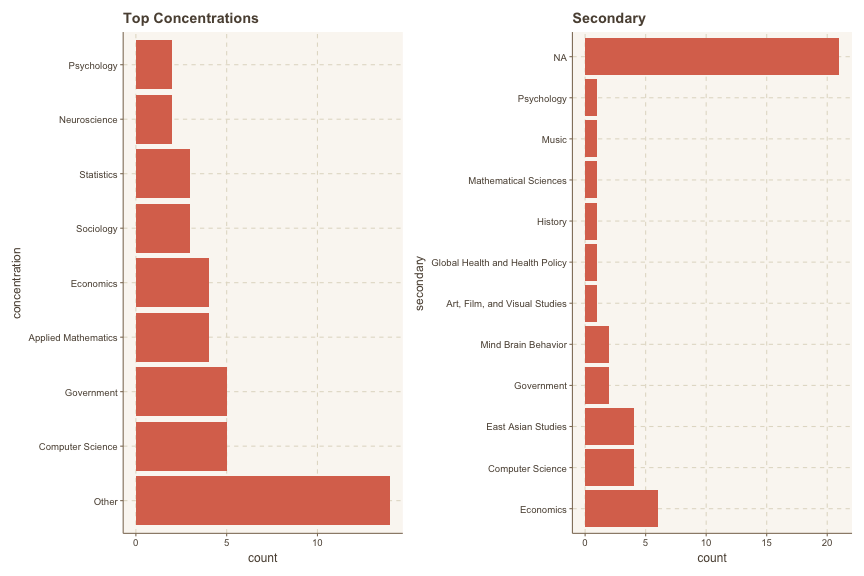
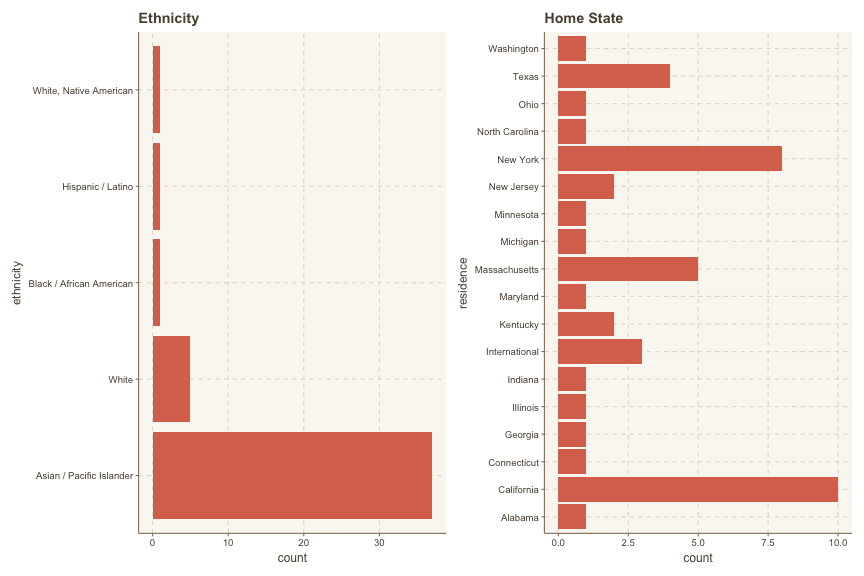

# The World of Emojis

Emojis have changed the way people communicate digitally in the 21st century, so much so that, in 2015, Oxford Dictionary's Word of the Year was not even a word, but an emoji ( 😂). Currently, there are 3,178 emojis in the Unicode Standard, with 117 new emojis slated to enter in 2020. With such a large number of possibilities, how do people choose which emojis to use when expressing their feelings? What is the difference between 😁and 😁, and how is meaning ascribed to 🙂 vs 🙃? 

While this study will not be able to answer all these questions fully, I aim to conduct an in-depth exploration of the connection between different internal and external traits of people and their emoji preferences and tendencies, specifically amongst the Harvard population.

This project was inspired by a [Tableau visualization](https://public.tableau.com/views/TheEmojiofSpotifyArtists/DescribeArtists?:embed=y&:display_count=y&:origin=viz_share_link) created by Spotify that analyzed public user-generated playlists for the most distinctive emoji use by artist.

# Data Collection

Emoji preference data was collected through a short, 1-minute survey, [linked here](https://forms.gle/RkFXovkt3fNKgfga8). The breakdown of the survey is as follows:
- Confirmation that the user is responding on an iPhone
- A single-line input asking for the user’s first two columns of their frequently-used emoji section (in order)
- Demographic information, such as year, gender, ethnicity and concentration

Responses to the survey were collected from the Harvard undergraduate community through various social circles, commons classes such as Gov1005, and house email lists. There are 45 overall responses. The author acknowledges that the data is very skewed across certain Harvard populations; however, due to unforeseen circumstances with COVID-19, overall sentiment, and thereby, emoji use has changed pre-and-post social distancing. In order to accurately capture a snapshot of life on campus without confounding variables, only data collected pre-departure was used. Below are brief overviews of respondent demographics:

## Noise in Data

A difficulty in collecting emoji preferences is the question of how to measure this in an objective way. I decided to limit participants to iPhone users because Apple has a standard formula of calculating its ‘frequently used emojis’ section. This provides a more quantitative method of understanding emoji use, rather than asking for the respondents’ own perception of their use. As Apple’s ‘frequently used emojis’ section is actually a mix of both frequently and recently used emojis, the responses were limited to the first two columns of the section (as Apple has indicated this as the ordering of emoji frequency). However, there is still the possibility of noise in this data from the (seeping in) of recently used emojis, such as a respondent who had Ice + Land in her response due to her recent messages about a spring break trip to Iceland. 

Furthermore, due to the limited reach of the author, the sample of students is not representative of the general Harvard community – there are demographics skews, as well as the existence of a selection bias from limiting responses to iPhone owners. However, this study is meant to highlight interesting and unexpected correlations in emoji use, rather than explain causal behaviors; please take all of this with a grain of salt.

# About the Author

Linda is a senior in Winthrop House studying Computer Science & Mind, Brain and Behavior, with a secondary in Economics. Her favorite emoji is 🌚, and the rest of her bio can be summed up very nicely by her most frequently used emojis: 😊 🥺 👀 🙆‍♀️ 😭 🤧 🥰 😅 🕊 ❣️.
